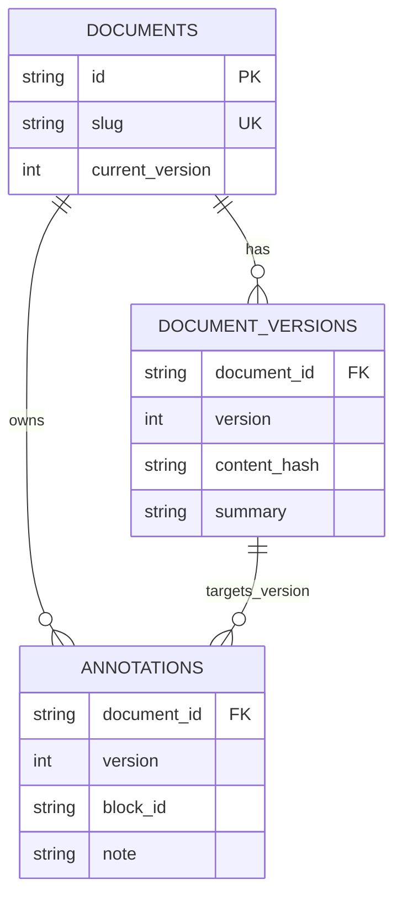
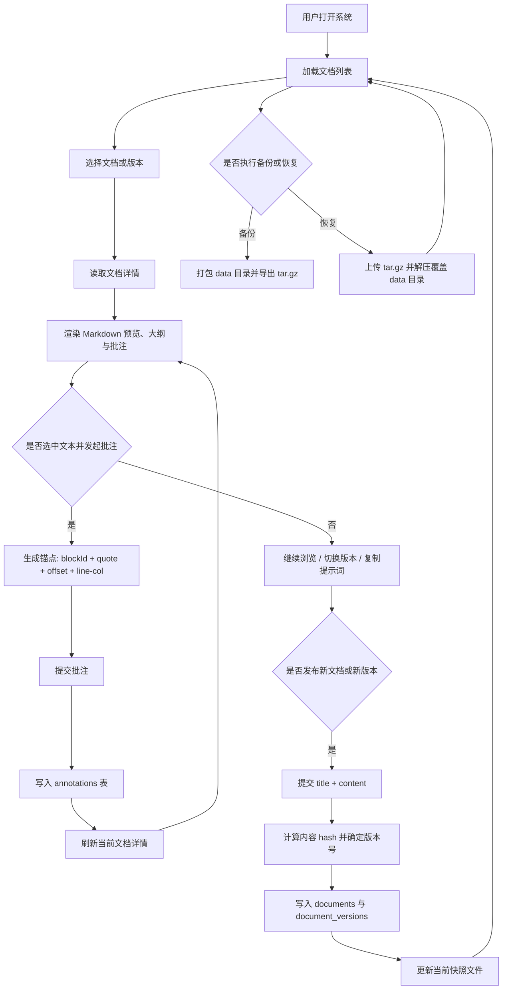

# 1. UI元素草图

```text
+----------------------------------------------------------------------------------------------+
| TalkAnnotate | v0.1 | 导出备份 | 导入恢复 | 明/暗切换                                         |
+--------------------------------+-------------------------------------------------------------+
| 文档侧栏                        | 主工作区                                                    |
|                                |                                                             |
| 文档总数 + 刷新                 | 标题 / slug / 当前版本 / 版本切换 / 复制提示词 / 刷新       |
| ------------------------------ | ----------------------------------------------------------- |
| [文档卡片]                      | Markdown 预览区                    | 批注侧栏              |
| 标题                            | - 标题/段落/列表/代码/图表         | - 批注卡片列表         |
| 版本号 / 更新时间 / 摘要        | - 带批注块显示计数角标             | - note / quote / 时间  |
|                                | - 选中文本后弹出批注入口           | - 跳转定位 / 删除      |
| [文档卡片]                      | - 点击批注卡片后联动高亮定位       |                        |
|                                |                                                             |
| 移动端：侧栏 -> 预览区 -> 批注区，三栏折叠为纵向堆叠。                                  |
+----------------------------------------------------------------------------------------------+
```

# 2. 数据模型设计



- 当前文档快照：`data/markdown/<slug>.md`
- 历史版本快照：`data/versions/<slug>/vNNNN.md`
- 版本粒度：文档以 `document_id + version` 管理；批注以 `document_id + version + block_id` 锚定到具体内容块

### 全量表结构

**documents**

| 字段名            | 取值范围                                                  | 业务含义                           |
| ----------------- | --------------------------------------------------------- | ---------------------------------- |
| id                | UUID 字符串                                               | 文档主键，系统内唯一标识           |
| slug              | 规范化标题 + 短 ID，如 `welcome-to-talkannotate-1a2b3c4d` | 用于文件路径和界面展示的稳定短标识 |
| title             | 非空字符串                                                | 文档标题                           |
| current_version   | 大于等于 1 的整数                                         | 当前对外展示的最新版本号           |
| current_file_path | `data/markdown/<slug>.md`                                 | 当前版本 Markdown 快照文件路径     |
| created_at        | 日期时间                                                  | 文档首次创建时间                   |
| updated_at        | 日期时间                                                  | 最近一次发布新版本的时间           |

**document_versions**

| 字段名       | 取值范围                              | 业务含义                               |
| ------------ | ------------------------------------- | -------------------------------------- |
| id           | UUID 字符串                           | 文档版本记录主键                       |
| document_id  | 已存在的 `documents.id`               | 所属文档                               |
| version      | 大于等于 1 的整数，且在同一文档内唯一 | 文档版本号                             |
| title        | 非空字符串                            | 该版本对应的标题快照                   |
| content_hash | 64 位 SHA-256 十六进制字符串          | 用于判断内容是否变化，避免重复生成版本 |
| summary      | 最长约 160 字符的摘要文本             | 用于列表卡片展示版本摘要               |
| file_path    | `data/versions/<slug>/vNNNN.md`       | 该历史版本的 Markdown 文件路径         |
| created_at   | 日期时间                              | 该版本生成时间                         |

**annotations**

| 字段名         | 取值范围                                         | 业务含义                                     |
| -------------- | ------------------------------------------------ | -------------------------------------------- |
| id             | UUID 字符串                                      | 批注主键                                     |
| document_id    | 已存在的 `documents.id`                          | 批注所属文档                                 |
| version        | 1 到 `documents.current_version` 的整数          | 批注命中的文档版本                           |
| note           | 非空字符串                                       | 用户填写的批注正文                           |
| color          | 当前固定为 `violet`                              | 批注显示颜色                                 |
| block_id       | 预览块标识，如 `p-128`、`h1-32`、`document-root` | 用于将批注定位到渲染后的内容块               |
| selected_text  | 非空字符串                                       | 用户实际选中的文本                           |
| quote          | 非空字符串                                       | 用于回显和二次匹配的引用片段                 |
| start_offset   | 大于等于 0 的整数                                | 选区在锚点块文本中的起始偏移                 |
| end_offset     | 大于 `start_offset` 的整数                       | 选区在锚点块文本中的结束偏移                 |
| context_before | 字符串，可为空                                   | 选中文本前的上下文，用于歧义消解             |
| context_after  | 字符串，可为空                                   | 选中文本后的上下文，用于歧义消解             |
| created_at     | 日期时间                                         | 批注创建时间                                 |
| start_line     | 可空正整数                                       | 选区起始行号，成功映射回 Markdown 源文时写入 |
| start_col      | 可空正整数                                       | 选区起始列号                                 |
| end_line       | 可空正整数                                       | 选区结束行号                                 |
| end_col        | 可空正整数                                       | 选区结束列号                                 |

# 3. 业务流程图


